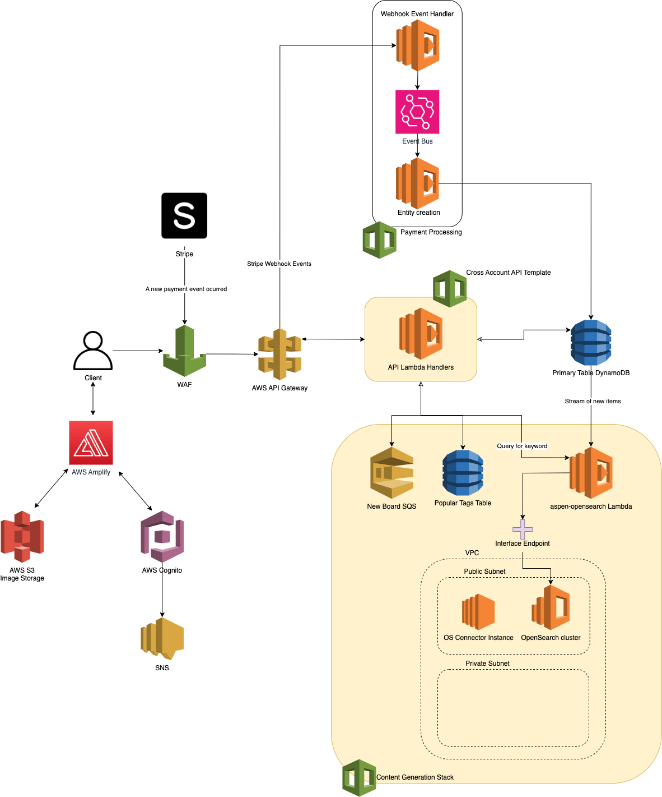

# Aspen - Art Marketplace and Social Media

## Mission

Aspen has the goal of giving amateur artists a platform to gain recognition and showcase their work. With a feed algorithm that promotes artists that don't have a large following, artists are guaranteed to be seen. Aspen uses a "boards" to display their in whatever format they choose, including custom backgrounds, text, and orientation.

## Features

- Feed with content customized to the user
- Buying and selling of art
- Push notifications
- Customizeable profile
- Search accross users, art, tags, and more

## Frontend Design

- Uses MVVM design pattern to manage screens
- Follows Single Responsibility Principle for components
- Handles app-wide state with a combination of Context API, HOC's, and global objects

## Backend Architecture

